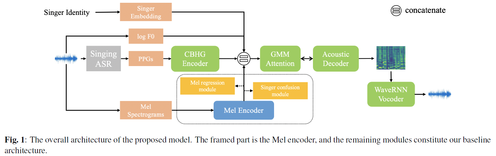
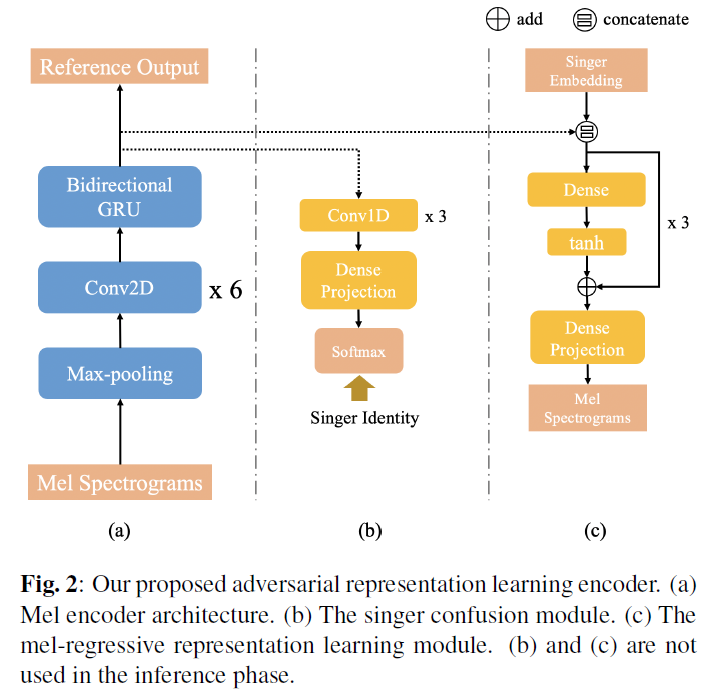

# ICASSP2021_paper_list-VC
Papers accepted to ICASSP 2021 in term of voice conversion (VC)

- [ICASSP2021_paper_list-VC](#icassp2021_paper_list-vc)
  - [VC](#vc)
  - [Zero-shot and low-resource VC](#zero-shot-and-low-resource-vc)
  - [cross-lingual VC](#cross-lingual-vc)
  - [Toolkit](#toolkit)
  - [Reading Note](#reading-note)
    - [1. Fragmentvc: any-to-any voice conversion by end-to-end extracting and fusing fine-grained voice fragments with attention.](#1-fragmentvc-any-to-any-voice-conversion-by-end-to-end-extracting-and-fusing-fine-grained-voice-fragments-with-attention)
    - [2. Maskcyclegan-vc: learning non-parallel voice conversion with filling in frames.](#2-maskcyclegan-vc-learning-non-parallel-voice-conversion-with-filling-in-frames)
    - [3. PPG-based singing voice conversion with adversarial representation learning.](#3-ppg-based-singing-voice-conversion-with-adversarial-representation-learning)
    - [4. Again-vc: a one-shot voice conversion using activation guidance and adaptive instance normalization.](#4-again-vc-a-one-shot-voice-conversion-using-activation-guidance-and-adaptive-instance-normalization)
    - [5. Any-to-One Sequence-to-Sequence Voice Conversion using Self-Supervised Discrete Speech Representations.](#5-any-to-one-sequence-to-sequence-voice-conversion-using-self-supervised-discrete-speech-representations)

## VC

1. [Maskcyclegan-vc: learning non-parallel voice conversion with filling in frames.](#2-maskcyclegan-vc-learning-non-parallel-voice-conversion-with-filling-in-frames-non-parallel-vc) ([paper](https://arxiv.org/pdf/2102.12841.pdf),[page](http://www.kecl.ntt.co.jp/people/kaneko.takuhiro/projects/maskcyclegan-vc/index.html))
2. Non-autoregressive sequence-to-sequence voice conversion. 
3. Non-parallel many-to-many voice conversion by knowledge transfer from a text-to-speech model.
4. Non-parallel many-to-many voice conversion using local linguistic tokens.
5. [PPG-based singing voice conversion with adversarial representation learning.](#3-ppg-based-singing-voice-conversion-with-adversarial-representation-learning)([paper](https://arxiv.org/pdf/2010.14804.pdf),[demo](https://lzh1.github.io/singVC/))

## Zero-shot and low-resource VC

1. [Again-vc: a one-shot voice conversion using activation guidance and adaptive instance normalization.](#4-again-vc-a-one-shot-voice-conversion-using-activation-guidance-and-adaptive-instance-normalization) ([paper](https://arxiv.org/pdf/2011.00316.pdf),[code](https://github.com/KimythAnly/AGAIN-VC))
2. Any-to-One Sequence-to-Sequence Voice Conversion using Self-Supervised Discrete Speech Representations. ([paper](https://arxiv.org/pdf/2010.12231.pdf),[Espnet parameter](https://gist.github.com/unilight/a48f99cf6a47c0b4e5b96fe1d6e59397))
3. [Fragmentvc: any-to-any voice conversion by end-to-end extracting and fusing fine-grained voice fragments with attention.](#1-fragmentvc-any-to-any-voice-conversion-by-end-to-end-extracting-and-fusing-fine-grained-voice-fragments-with-attention-non-parallel-vc) *National Taiwan University* ([paper](https://arxiv.org/pdf/2010.14150.pdf),[code](https://github.com/yistLin/FragmentVC))
4. End-to-end lyrics recognition with voice to singing style transfer. ([paper](https://arxiv.org/pdf/2102.08575.pdf),[demo](https://github.com/iiscleap/V2S_Samples))
5. One-shot voice conversion based on speaker aware module
6. Seen and unseen emotional style transfer for voice conversion with a new emotional speech dataset. ([paper](https://arxiv.org/pdf/2010.14794.pdf),[code](https://kunzhou9646.github.io/controllable-evc/))
7. Towards low-resource stargan voice conversion using weight adaptive instance normalization. ([paper](https://arxiv.org/pdf/2010.11646.pdf),[code](https://github.com/MingjieChen/LowResourceVC))
8. Zero-shot voice conversion with adjusted speaker embeddings and simple acoustic features. 
9. Extending parrotron: an end-to-end, speech conversion and speech recognition model for atypical speech. 
10. Zero-shot voice conversion with adjusted speaker embeddings and simple acoustic features.

## cross-lingual VC
1. Multi-task wavernn with an integrated architecture for cross-lingual voice conversion
2. Towards natural and controllable cross-lingual voice conversion based on neural tts model and phonetic posteriorgram ([paper](https://arxiv.org/pdf/2102.01991.pdf))

## Toolkit

1. crank: an open-source software for nonparallel voice conversion based on vector-quantized variational autoencoder ([paper](https://arxiv.org/pdf/2103.02858.pdf),[code](https://github.com/k2kobayashi/crank))

## Reading Note

### 1. Fragmentvc: any-to-any voice conversion by end-to-end extracting and fusing fine-grained voice fragments with attention.

* 概要：通过Wav2Vec获取source speaker说话人无关的语音内容特征，利用cross-attention的形式从target speaker的语音特征中获取说话人信息，并在decode阶段重构具有source speaker内容和target speaker音色的梅尔普。**通过两阶段训练的方式，可以在不利用disentangle等策略和平行语料的条件下，仅通过L1损失实现模型的训练。** 
* code: https://github.com/yistLin/FragmentVC

* 利用在Librispeech上预训练的wav2vec提取source speaker的语义内容特征。
* Target encoder由一维卷积和激活函数ReLU构成。
* Extractor: Transformer with self-attention and cross-attention。三个Extractor和对应的三个Conn1d构成了stack式的连接。
* Smoother: Transformer with only self-attention. Smoother和Extractor中的feed-forward layer由一层一维卷积代替。
* 由于Wav2Vec不可避免的保留了一些源说话人的信息，作者在Extractor 1中去掉了残差连接，认为这样可以尽可能剔除源说话人的信息。
* **训练策略：** 第一阶段：利用同一个人的同一句话同时作为target和source的输入，以训练模型从Wav2Vec特征重构mel谱特征的能力。第二阶段：target和source的输入依旧来自于同一个人，不同的是，target的输入是10个语音片段的拼接，而source的输入只是一句话。需要注意的是，在开始阶段，source的输入来自于输入target的十句话中的一句，随着训练的进行，逐渐增大来自这十句以外的概率，并最终使得source的输入是来自target十句的概率为0.

### 2. Maskcyclegan-vc: learning non-parallel voice conversion with filling in frames.

* 概要：在CycleGAN-VC2基础上，借鉴Bert及image inpainting的训练方法，对source speech添加mask, 并训练conversion网络对mask的区域进行fill.

* 文中尝试了几种不同的mask概率，包括：1)固定概率 2)在某一个概率范围内的随机选择. 实验发现，mask在概率[0,50]随机选择时效果最好。
* 文中尝试了几种不同的mask方式，包括：1)连续帧的mask 2)不连续帧的mask 3)对某一个频带范围进行mask 4)离散点的mask. 实验发现连续帧的mask形式，也即示意图中的$m$表现最好。

### 3. PPG-based singing voice conversion with adversarial representation learning.

* 概要： 借助PPG特征获取source singer的文本内容信息。但是由于在SVC中源说话人的韵律、节奏等也是很重要的信息，所以文中有引入了Singer Confusion Module来补充源说话人除了音色以外的信息。

* Singer Confusion Module的训练采用了对抗训练的方式，学习一个singer-indpendent的mel谱特征。为了进一步确保所学特征包含了除音色（singer identity）以外的其他信息，增加了一个Mel-Regressive Representation learning Module。该模块通过将学习到的mel特征和speaker embedding融合并重构原始song.

### 4. Again-vc: a one-shot voice conversion using activation guidance and adaptive instance normalization.
* 概要：Again-VC在AdaIN-VC的基础上去掉了单独的Speaker Encoder, 转而利用Content Encoder中的instance normalization操作获取均值和方差信息来传递speaker信息。这一speark信息在decode过程中，通过与content embedding进行Adaptive instance normalization (AdaIN) 操作进行speaker信息的传递。

* code: https://github.com/KimythAnly/AGAIN-VC

* 关于instance normalization (IN): 对于一个mel谱$Z$, IN操作如下为：
    $\operatorname{IN}(Z)=\frac{Z-\mu(Z)}{\sigma(Z)}$，其中平均值$\mu$和方差$\sigma$是基于channel wise的。在AdaIN-VC中，作者认为这种时间不变性的参数$\mu$和$\sigma$是可以代表speaker信息的。

* Adaptive instance nomalization (AdapIN) 可以看作是IN的逆操作，不过这里采用的$\mu$和$\sigma$是目标说话的参数。比如，如果我们希望保留$H$的内容，但将风格迁移到$Z$的风格上，AdapIN的操作可表示为：$\operatorname{AdaIN}(\boldsymbol{H}, \mu(\boldsymbol{Z}), \sigma(\boldsymbol{Z}))=\sigma(\boldsymbol{Z}) \operatorname{IN}(\boldsymbol{H})+\mu(\boldsymbol{Z})$

* 文中有意思的一点是关于激活函数的选择。作者认为，通过在encoder的输出层添加激活函数（如图中左下角的Activations）可以更好的去除content embedding中的源说话人信息。文中对比了几种不同的激活函数，发现sigmoid的效果最好。如下表所示，分别利用content embedding （$C$）和由$\mu$及$\sigma$组成的speaker info $S$训练一个speaker的分类器，理想状态下基于$C$的精度越低越好，而基于$S$的精度应该越高越好：

### 5. Any-to-One Sequence-to-Sequence Voice Conversion using Self-Supervised Discrete Speech Representations.

